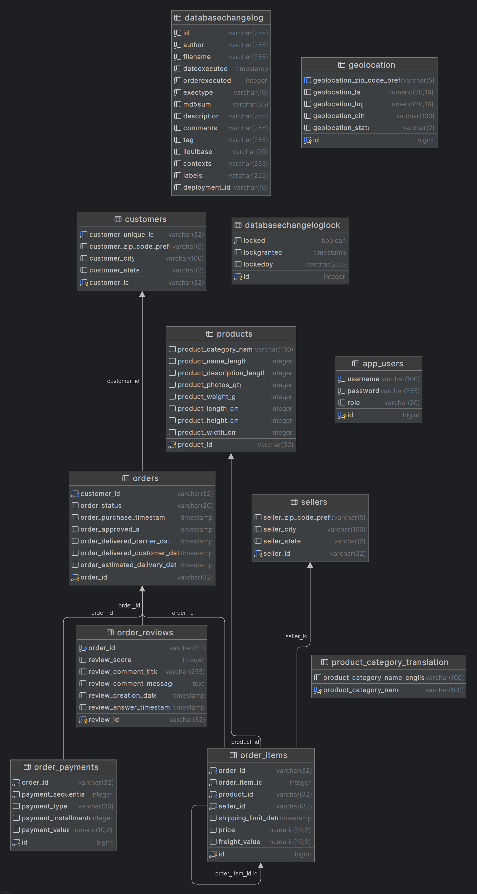

# Onion Architecture - Spring Boot 4 + Java 25

API REST de e-commerce baseada no dataset Olist, implementada com **Onion Architecture**, autenticação JWT, HATEOAS, Swagger/OpenAPI, Vault e Liquibase.

---

## Tecnologias

| Tecnologia | Versão | Finalidade |
|------------|--------|------------|
| Java | 25 | Linguagem |
| Spring Boot | 4.0.6 | Framework |
| Spring Security | 7.x | Autenticação/Autorização |
| Spring HATEOAS | - | Modelo de maturidade REST |
| SpringDoc OpenAPI | 3.0.2 | Documentação Swagger |
| PostgreSQL | latest | Banco de dados |
| Liquibase | - | Versionamento de schema |
| HashiCorp Vault | latest | Gerenciamento de secrets |
| JJWT | 0.12.6 | Geração/Validação de tokens JWT |
| Bucket4j | 8.14.0 | Rate Limiting por IP |
| Kubernetes | - | Orquestração de containers |
| Terraform | >= 1.5 | Infraestrutura como código (AWS, Azure, GCP) |
| Lombok | - | Redução de boilerplate |
| Docker | - | Containerização |

---

## Arquitetura Onion

```
┌─────────────────────────────────────────────────────────┐
│                    Presentation                          │
│         Controllers, Assemblers (HATEOAS)               │
├─────────────────────────────────────────────────────────┤
│                    Application                           │
│          Services, DTOs, Mappers                         │
├─────────────────────────────────────────────────────────┤
│                    Domain (Core)                          │
│           Entities, Repository Interfaces                │
├─────────────────────────────────────────────────────────┤
│                   Infrastructure                         │
│    JPA Repositories, Security, Config                    │
└─────────────────────────────────────────────────────────┘
```

### Estrutura de Pacotes

```
br.com.onion
├── domain/
│   ├── entity/          # Entidades JPA (core do domínio)
│   └── repository/      # Interfaces de repositório (contratos)
├── application/
│   ├── service/         # Lógica de negócio
│   ├── dto/
│   │   ├── request/     # Payloads de entrada com validação
│   │   └── response/    # Payloads de saída com HATEOAS
│   └── mapper/          # Conversão Entity ↔ DTO
├── infrastructure/
│   ├── repository/      # Implementações JPA
│   ├── config/          # SecurityConfig, GlobalExceptionHandler, OpenApiConfig
│   └── security/        # JWT (Service, Filter, UserDetailsService)
└── presentation/
    ├── controller/      # REST Controllers
    └── assembler/       # HATEOAS Model Assemblers
```

---

## Modelo de Dados

Baseado no dataset [Brazilian E-Commerce (Olist)](https://www.kaggle.com/datasets/olistbr/brazilian-ecommerce):

### Diagrama Entidade-Relacionamento (DER)



O DER acima ilustra os relacionamentos entre as tabelas do sistema:
- **customers** → **orders**: Um cliente pode ter vários pedidos (1:N)
- **orders** → **order_items**: Um pedido pode ter vários itens (1:N)
- **orders** → **order_payments**: Um pedido pode ter vários pagamentos (1:N)
- **orders** → **order_reviews**: Um pedido pode ter várias avaliações (1:N)
- **order_items** → **products**: Cada item referencia um produto (N:1)
- **order_items** → **sellers**: Cada item referencia um vendedor (N:1)
- **products** → **product_category_translation**: Categoria do produto com tradução
- **geolocation**: Dados geográficos por prefixo de CEP
- **app_users** / **refresh_tokens**: Tabelas de autenticação (independentes do domínio de negócio)

| Tabela | Registros | Descrição |
|--------|-----------|-----------|
| `customers` | 99.441 | Clientes |
| `sellers` | 3.095 | Vendedores |
| `products` | 32.951 | Produtos |
| `product_category_translation` | 71 | Tradução de categorias |
| `geolocation` | - | Geolocalização por CEP (importação manual) |
| `orders` | 99.441 | Pedidos |
| `order_items` | 112.650 | Itens do pedido |
| `order_payments` | 103.886 | Pagamentos |
| `order_reviews` | 104.164 | Avaliações |
| `app_users` | - | Usuários da aplicação (autenticação) |
| `refresh_tokens` | - | Tokens de refresh para renovação de sessão |

---

## Pré-requisitos

- Java 25+
- Maven 3.9+
- Docker e Docker Compose
- kubectl (para deploy em Kubernetes)
- Terraform >= 1.5 (para provisionamento de infraestrutura)

---

## Configuração

### 1. Variáveis de Ambiente

Crie um arquivo `.env` na raiz do projeto baseado no `.env.example`:

```env
DB_URL=jdbc:postgresql://localhost:5432/onion_db
DB_USERNAME=seu_usuario
DB_PASSWORD=sua_senha

VAULT_URI=http://localhost:8200
VAULT_TOKEN=seu_token_vault
VAULT_ENABLED=true

JWT_SECRET=SuaChaveSecretaComNoMinimo256BitsParaHMACSHA256
```

> **Nota:** Ao rodar pela IDE sem variáveis de ambiente, a aplicação usa valores default configurados no `application.yml` (Vault desabilitado).

### 2. Vault (Secrets)

Após subir o Vault, configure os secrets:

```bash
export VAULT_ADDR=http://localhost:8200
export VAULT_TOKEN=seu_token_vault

vault kv put secret/onion \
  DB_USERNAME=seu_usuario \
  DB_PASSWORD=sua_senha \
  JWT_SECRET=SuaChaveSecretaComNoMinimo256BitsParaHMACSHA256
```

---

## Execução

### Modo Local (desenvolvimento)

Sobe apenas a infraestrutura (PostgreSQL + Vault) no Docker e roda a aplicação localmente:

```bash
# Subir infraestrutura
docker-compose up -d

# Rodar aplicação
./mvnw spring-boot:run
```

Ou rode diretamente pela IDE sem nenhuma configuração adicional — os valores default já estão no `application.yml`.

> **Primeira execução:** O Liquibase criará as tabelas e importará os dados do dataset Olist automaticamente. Esse processo pode levar alguns minutos devido ao volume de dados (~500k registros).

### Modo Docker (tudo containerizado)

```bash
docker-compose --profile full up -d --build
```

### Parar os serviços

```bash
docker-compose --profile full down
```

---

## Importação de Dados

Os dados do dataset Olist são importados automaticamente pelo Liquibase na primeira execução:

| Changelog | Dados |
|-----------|-------|
| `011-load-data.yaml` | Customers, Sellers, Products, Categories, Orders, Order Items, Order Payments |

Os CSVs originais estão em `src/main/resources/db/data/`.

### Importação Manual

Alguns datasets possuem caracteres especiais ou volume muito grande e não são importados automaticamente:

| Dataset | Registros | Motivo |
|---------|-----------|--------|
| `olist_geolocation_dataset.csv` | 1.000.163 | Volume muito grande |
| `olist_order_reviews_dataset.csv` | 104.164 | Caracteres especiais nos comentários |

Para importá-los manualmente via Docker:

```bash
# Geolocation
docker exec -i postgres-onion psql -U gmontinny -d onion_db -c "\copy geolocation(geolocation_zip_code_prefix, geolocation_lat, geolocation_lng, geolocation_city, geolocation_state) FROM STDIN CSV HEADER" < data/olist_geolocation_dataset.csv

# Order Reviews
docker exec -i postgres-onion psql -U gmontinny -d onion_db -c "\copy order_reviews(review_id, order_id, review_score, review_comment_title, review_comment_message, review_creation_date, review_answer_timestamp) FROM STDIN CSV HEADER" < data/olist_order_reviews_dataset.csv
```

---

## Swagger / OpenAPI

A documentação interativa da API está disponível em:

| Recurso | URL |
|---------|-----|
| Swagger UI | http://localhost:8080/swagger-ui.html |
| OpenAPI JSON | http://localhost:8080/v3/api-docs |
| OpenAPI YAML | http://localhost:8080/v3/api-docs.yaml |

O Swagger UI permite:
- Visualizar todos os endpoints documentados
- Testar requisições diretamente no navegador
- Autenticar via botão **Authorize** (inserir token JWT)
- Ver schemas de request/response com exemplos

> Os endpoints do Swagger são públicos (não requerem autenticação).

---

## Endpoints da API

### Autenticação

| Método | Endpoint | Descrição |
|--------|----------|-----------|
| POST | `/api/auth/register` | Registrar novo usuário |
| POST | `/api/auth/login` | Autenticar e obter token |
| POST | `/api/auth/refresh` | Renovar access token via refresh token |

**Registro/Login - Request Body:**
```json
{
  "username": "usuario",
  "password": "senha123"
}
```

**Response:**
```json
{
  "token": "eyJhbGciOiJIUzI1NiJ9...",
  "refreshToken": "550e8400-e29b-41d4-a716-446655440000",
  "username": "usuario",
  "role": "USER"
}
```

**Refresh Token - Request Body:**
```json
{
  "refreshToken": "550e8400-e29b-41d4-a716-446655440000"
}
```

### Customers

| Método | Endpoint | Descrição |
|--------|----------|-----------|
| GET | `/api/customers` | Listar (paginado) |
| GET | `/api/customers/{id}` | Buscar por ID |
| POST | `/api/customers` | Criar |
| PUT | `/api/customers/{id}` | Atualizar |
| DELETE | `/api/customers/{id}` | Remover |

### Products

| Método | Endpoint | Descrição |
|--------|----------|-----------|
| GET | `/api/products` | Listar (paginado) |
| GET | `/api/products/{id}` | Buscar por ID |
| POST | `/api/products` | Criar |
| PUT | `/api/products/{id}` | Atualizar |
| DELETE | `/api/products/{id}` | Remover |

### Sellers

| Método | Endpoint | Descrição |
|--------|----------|-----------|
| GET | `/api/sellers` | Listar (paginado) |
| GET | `/api/sellers/{id}` | Buscar por ID |
| POST | `/api/sellers` | Criar |
| PUT | `/api/sellers/{id}` | Atualizar |
| DELETE | `/api/sellers/{id}` | Remover |

### Orders

| Método | Endpoint | Descrição |
|--------|----------|-----------|
| GET | `/api/orders` | Listar (paginado) |
| GET | `/api/orders/{id}` | Buscar por ID |
| GET | `/api/orders/customer/{customerId}` | Buscar por cliente |
| POST | `/api/orders` | Criar |
| DELETE | `/api/orders/{id}` | Remover |

### Order Items

| Método | Endpoint | Descrição |
|--------|----------|-----------|
| GET | `/api/order-items` | Listar (paginado) |
| GET | `/api/order-items/{id}` | Buscar por ID |
| GET | `/api/order-items/order/{orderId}` | Buscar por pedido |
| POST | `/api/order-items` | Criar |
| DELETE | `/api/order-items/{id}` | Remover |

### Order Payments

| Método | Endpoint | Descrição |
|--------|----------|-----------|
| GET | `/api/order-payments` | Listar (paginado) |
| GET | `/api/order-payments/{id}` | Buscar por ID |
| GET | `/api/order-payments/order/{orderId}` | Buscar por pedido |
| POST | `/api/order-payments` | Criar |
| DELETE | `/api/order-payments/{id}` | Remover |

### Order Reviews

| Método | Endpoint | Descrição |
|--------|----------|-----------|
| GET | `/api/order-reviews` | Listar (paginado) |
| GET | `/api/order-reviews/{id}` | Buscar por ID |
| GET | `/api/order-reviews/order/{orderId}` | Buscar por pedido |
| POST | `/api/order-reviews` | Criar |
| DELETE | `/api/order-reviews/{id}` | Remover |

### Geolocations

| Método | Endpoint | Descrição |
|--------|----------|-----------|
| GET | `/api/geolocations` | Listar (paginado) |
| GET | `/api/geolocations/{id}` | Buscar por ID |
| GET | `/api/geolocations/zipcode/{zipCodePrefix}` | Buscar por CEP |
| POST | `/api/geolocations` | Criar |
| PUT | `/api/geolocations/{id}` | Atualizar |
| DELETE | `/api/geolocations/{id}` | Remover |

### Product Categories

| Método | Endpoint | Descrição |
|--------|----------|-----------|
| GET | `/api/categories` | Listar (paginado) |
| GET | `/api/categories/{categoryName}` | Buscar por nome |
| POST | `/api/categories` | Criar |
| PUT | `/api/categories/{categoryName}` | Atualizar |
| DELETE | `/api/categories/{categoryName}` | Remover |

---

## Autenticação JWT

Todos os endpoints (exceto `/api/auth/**` e `/swagger-ui/**`) requerem o header:

```
Authorization: Bearer <token>
```

**Fluxo:**
1. Registre-se em `POST /api/auth/register` ou faça login em `POST /api/auth/login`
2. Use o `token` (access token) no header `Authorization` das demais requisições
3. Quando o access token expirar (15 min), use o `refreshToken` em `POST /api/auth/refresh` para obter um novo
4. O refresh token é válido por 7 dias
5. No Swagger UI, clique em **Authorize** e cole o access token

### Tokens

| Token | Duração | Uso |
|-------|---------|-----|
| Access Token | 15 minutos | Header `Authorization: Bearer <token>` |
| Refresh Token | 7 dias | Body de `POST /api/auth/refresh` |

---

## Rate Limiting

A API possui rate limiting por IP para proteção contra abuso:

| Configuração | Valor |
|-------------|-------|
| Limite | 60 requisições por minuto por IP |
| Resposta ao exceder | HTTP 429 Too Many Requests |

**Response quando excede o limite:**
```json
{
  "status": 429,
  "message": "Rate limit exceeded. Try again later."
}
```

> O limite é configurável via `rate-limit.requests-per-minute` no `application.yml`.

---

## HATEOAS

As respostas incluem links de navegação seguindo o modelo de maturidade Richardson (Level 3):

```json
{
  "id": "abc123",
  "city": "São Paulo",
  "state": "SP",
  "_links": {
    "self": { "href": "http://localhost:8080/api/customers/abc123" },
    "customers": { "href": "http://localhost:8080/api/customers" }
  }
}
```

---

## Paginação

Todos os endpoints de listagem suportam paginação via query params:

```
GET /api/customers?page=0&size=20&sort=city,asc
```

**Response paginada:**
```json
{
  "_embedded": [...],
  "page": {
    "size": 20,
    "number": 0,
    "totalElements": 99441
  }
}
```

---

## Liquibase - Versionamento do Banco

Os changelogs estão em `src/main/resources/db/changelog/`:

| Arquivo | Descrição |
|---------|-----------|
| `001-create-customers.yaml` | Cria tabela customers |
| `002-create-sellers.yaml` | Cria tabela sellers |
| `003-create-products.yaml` | Cria tabela products |
| `004-create-product-category-translation.yaml` | Cria tabela product_category_translation |
| `005-create-geolocation.yaml` | Cria tabela geolocation |
| `006-create-orders.yaml` | Cria tabela orders |
| `007-create-order-items.yaml` | Cria tabela order_items |
| `008-create-order-payments.yaml` | Cria tabela order_payments |
| `009-create-order-reviews.yaml` | Cria tabela order_reviews |
| `010-create-app-users.yaml` | Cria tabela app_users |
| `011-load-data.yaml` | Importa dados do dataset Olist (CSVs) |
| `012-create-refresh-tokens.yaml` | Cria tabela refresh_tokens |

As migrations e importação de dados são executadas automaticamente ao iniciar a aplicação.

---

## Vault - Gerenciamento de Secrets

A aplicação utiliza HashiCorp Vault para armazenar variáveis sensíveis:

- Credenciais do banco de dados
- Secret do JWT
- Qualquer outra configuração sensível

O Vault é configurado via `bootstrap.yml` e as propriedades são injetadas automaticamente pelo Spring Cloud Vault.

> **Nota:** Em modo local (IDE), o Vault é desabilitado por default. Para ativá-lo, defina `VAULT_ENABLED=true`.

---

## Validação

Os DTOs de request utilizam Bean Validation:

```java
@NotBlank(message = "City is required")
@Size(max = 100)
private String city;
```

Erros de validação retornam HTTP 400 com detalhes:

```json
{
  "timestamp": "2025-01-01T00:00:00",
  "status": 400,
  "errors": {
    "city": "City is required",
    "state": "State is required"
  }
}
```

---

## Docker

### Dockerfile

Multi-stage build otimizado:
- **Stage 1 (build):** JDK 25 Alpine - compila o projeto
- **Stage 2 (runtime):** JRE 25 Alpine - imagem final leve (~200MB)

### Serviços do Docker Compose

| Serviço | Container | Porta | Profile |
|---------|-----------|-------|---------|
| PostgreSQL | postgres-onion | 5432 | default |
| Vault | vault-onion | 8200 | default |
| App | onion-app | 8080 | `full` |

---

## Kubernetes

Os manifests estão em `k8s/`:

| Arquivo | Descrição |
|---------|-----------|
| `namespace.yaml` | Namespace `onion` |
| `configmap.yaml` | Configurações não-sensíveis (DB_URL, VAULT_ENABLED) |
| `secrets.yaml` | Template para credenciais (DB, JWT, Vault) |
| `postgres.yaml` | Deployment + Service + PVC do PostgreSQL |
| `app.yaml` | Deployment + Service + Ingress + HPA da aplicação |

### Recursos

- **HPA** (Horizontal Pod Autoscaler): 2→10 pods, baseado em CPU 70%
- **Health Probes**: liveness + readiness via `/actuator/health`
- **Resource Limits**: CPU e memória definidos por container
- **Ingress**: NGINX com suporte a SSL
- **PVC**: Persistência de dados do PostgreSQL

### Deploy manual com kubectl

```bash
kubectl apply -f k8s/namespace.yaml
kubectl apply -f k8s/configmap.yaml
kubectl apply -f k8s/secrets.yaml    # editar valores antes
kubectl apply -f k8s/postgres.yaml
kubectl apply -f k8s/app.yaml
```

---

## Terraform - Infraestrutura como Código

A aplicação pode ser provisionada em clusters Kubernetes gerenciados nos 3 principais cloud providers:

| Provider | Serviço | Diretório |
|----------|---------|----------|
| AWS | EKS (Elastic Kubernetes Service) | `terraform/aws/` |
| Azure | AKS (Azure Kubernetes Service) | `terraform/azure/` |
| GCP | GKE (Google Kubernetes Engine) | `terraform/gcp/` |
| Shared | Módulo K8s reutilizável | `terraform/modules/k8s/` |

### Arquitetura Terraform

```
terraform/
├── modules/
│   └── k8s/          # Módulo compartilhado (deploy da app no cluster)
├── aws/              # VPC + EKS + deploy
├── azure/            # Resource Group + AKS + deploy
└── gcp/              # VPC + GKE + deploy
```

Cada provider provisiona:
- Rede (VPC/Subnet)
- Cluster Kubernetes gerenciado com auto-scaling (2→5 nodes)
- Deploy da aplicação via módulo compartilhado (pods, services, HPA)

### Deploy com Terraform

```bash
# AWS (EKS)
cd terraform/aws
cp terraform.tfvars.example terraform.tfvars  # editar valores
terraform init
terraform plan
terraform apply

# Azure (AKS)
cd terraform/azure
cp terraform.tfvars.example terraform.tfvars
terraform init
terraform plan
terraform apply

# GCP (GKE)
cd terraform/gcp
cp terraform.tfvars.example terraform.tfvars
terraform init
terraform plan
terraform apply
```

### Variáveis necessárias

| Variável | Descrição |
|----------|-----------|
| `app_image` | URI da imagem no registry (ECR/ACR/GCR) |
| `db_username` | Usuário do banco de dados |
| `db_password` | Senha do banco de dados |
| `jwt_secret` | Secret para geração de tokens JWT |
| `region` | Região do cloud provider |
| `cluster_name` | Nome do cluster Kubernetes |

### Destruir infraestrutura

```bash
terraform destroy
```

---

## Exemplos de Uso (cURL)

### Registrar usuário
```bash
curl -X POST http://localhost:8080/api/auth/register \
  -H "Content-Type: application/json" \
  -d '{"username": "admin", "password": "admin123"}'
```

### Login
```bash
curl -X POST http://localhost:8080/api/auth/login \
  -H "Content-Type: application/json" \
  -d '{"username": "admin", "password": "admin123"}'
```

### Renovar token (refresh)
```bash
curl -X POST http://localhost:8080/api/auth/refresh \
  -H "Content-Type: application/json" \
  -d '{"refreshToken": "550e8400-e29b-41d4-a716-446655440000"}'
```

### Criar customer (autenticado)
```bash
curl -X POST http://localhost:8080/api/customers \
  -H "Content-Type: application/json" \
  -H "Authorization: Bearer <token>" \
  -d '{
    "uniqueId": "abc123def456",
    "zipCodePrefix": "01001",
    "city": "São Paulo",
    "state": "SP"
  }'
```

### Listar products (paginado)
```bash
curl http://localhost:8080/api/products?page=0&size=10 \
  -H "Authorization: Bearer <token>"
```

### Criar item de pedido
```bash
curl -X POST http://localhost:8080/api/order-items \
  -H "Content-Type: application/json" \
  -H "Authorization: Bearer <token>" \
  -d '{
    "orderId": "e481f51cbdc54678b7cc49136f2d6af7",
    "orderItemId": 1,
    "productId": "4244733e06e7ecb4970a6e2683c13e61",
    "sellerId": "48436dade18ac8b2bce089ec2a041202",
    "price": 58.90,
    "freightValue": 13.29
  }'
```

### Criar pagamento
```bash
curl -X POST http://localhost:8080/api/order-payments \
  -H "Content-Type: application/json" \
  -H "Authorization: Bearer <token>" \
  -d '{
    "orderId": "b81ef226f3fe1789b1e8b2acac839d17",
    "paymentSequential": 1,
    "paymentType": "credit_card",
    "paymentInstallments": 8,
    "paymentValue": 99.33
  }'
```

### Criar avaliação
```bash
curl -X POST http://localhost:8080/api/order-reviews \
  -H "Content-Type: application/json" \
  -H "Authorization: Bearer <token>" \
  -d '{
    "orderId": "73fc7af87114b39712e6da79b0a377eb",
    "reviewScore": 4,
    "reviewCommentTitle": "Muito bom",
    "reviewCommentMessage": "Produto chegou antes do prazo"
  }'
```

### Buscar geolocalização por CEP
```bash
curl http://localhost:8080/api/geolocations/zipcode/01037 \
  -H "Authorization: Bearer <token>"
```

### Criar categoria de produto
```bash
curl -X POST http://localhost:8080/api/categories \
  -H "Content-Type: application/json" \
  -H "Authorization: Bearer <token>" \
  -d '{
    "categoryName": "beleza_saude",
    "categoryNameEnglish": "health_beauty"
  }'
```

---

## Design Patterns Utilizados

| Pattern | Onde |
|---------|------|
| Repository | Domain/Infrastructure layer |
| DTO (Data Transfer Object) | Request/Response payloads |
| Mapper | Conversão entre camadas |
| Builder | Entidades e DTOs (via Lombok) |
| Filter Chain | JWT Authentication Filter, Rate Limit Filter |
| Template Method | RepresentationModelAssembler |
| Dependency Inversion | Interfaces no Domain, implementações na Infrastructure |

---

## Licença

Este projeto é para fins educacionais.
